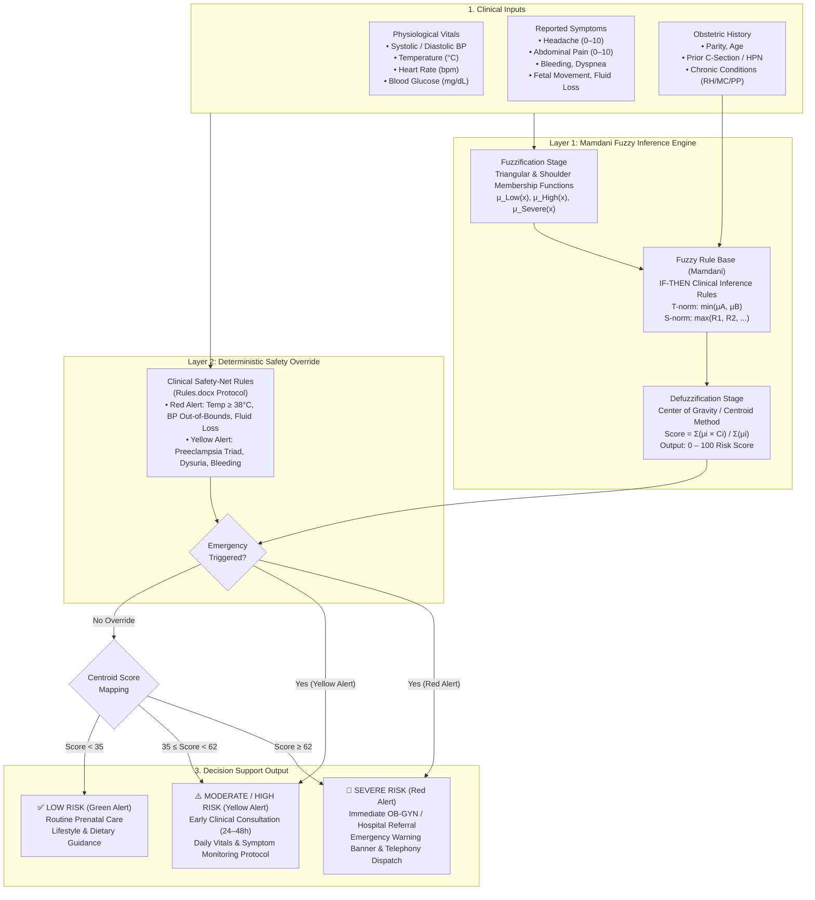
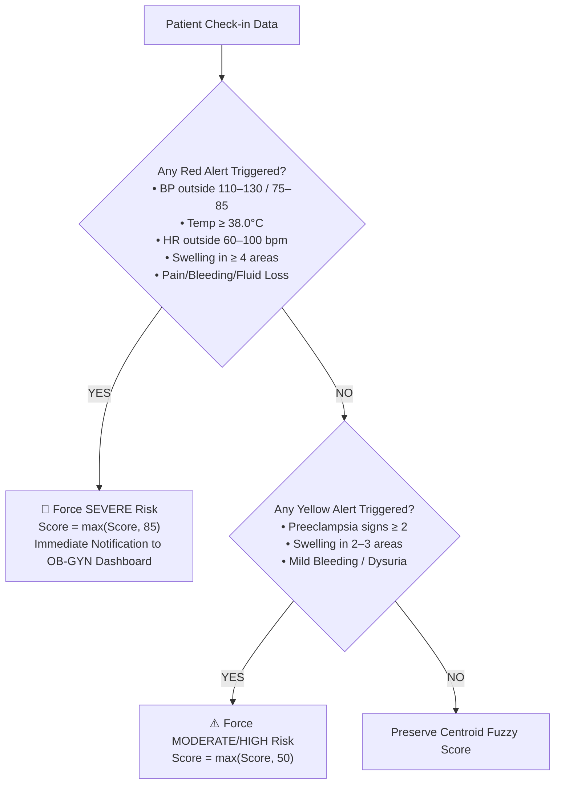

# Methodology: Fuzzy Logic Clinical Decision Support System for Maternal Risk Assessment

## 1. System Overview & Theoretical Background

Traditional clinical decision algorithms rely on crisp Boolean thresholds (e.g., systolic blood pressure $\ge 140\text{ mmHg}$ is classified as abnormal, while $139\text{ mmHg}$ is classified as completely normal). However, physiological changes during pregnancy are dynamic, continuous, and interrelated. A pregnant patient presenting with borderline elevated blood pressure ($134\text{ mmHg}$), a moderate headache ($5/10$ intensity), and mild ankle edema does not trigger traditional single-parameter alarms individually, yet collectively presents a high-risk trajectory for preeclampsia.

To address these non-linear clinical interactions, **PregnaCare** integrates a **dual-layer hybrid artificial intelligence architecture**:
1. **Mamdani Fuzzy Inference Engine**: Models uncertainty, continuous clinical severity, and multi-symptom interactions using fuzzy set theory and centroid defuzzification.
2. **Deterministic Clinical Safety-Net Override Layer**: Enforces non-compensatory emergency rules derived from clinical obstetric protocols (e.g., *Rules.docx*), guaranteeing that acute danger signs (e.g., eclamptic seizures, high fever $\ge 38^\circ\text{C}$, severe hemorrhage) immediately escalate to **Severe Risk** regardless of other stable parameters.

---

## 2. Architectural Flow Diagram

The complete data flow—from patient sensory and physiological input to defuzzified risk score and clinical recommendation—is depicted in **Figure 1**.


*Figure 1: Hybrid Dual-Layer Maternal Risk Evaluation Architecture.*

---

## 3. Mathematical Formulation of the Fuzzy System

### 3.1 Universe of Discourse & Linguistic Variables
Let $X$ denote the universe of discourse for an input parameter. The clinical input is mapped to fuzzy linguistic sets $T(X) = \{\text{Low}, \text{High}, \text{Severe}\}$.

### 3.2 Membership Functions ($\mu$)
The system employs piecewise linear **Triangular** and **Trapezoidal (Shoulder)** membership functions to represent clinical transitions smoothly:

1. **Triangular Membership Function**:
   $$\mu_{\text{tri}}(x; a, b, c) = \begin{cases} 
   0, & x \le a \\ 
   \frac{x - a}{b - a}, & a < x \le b \\ 
   \frac{c - x}{c - b}, & b < x < c \\ 
   0, & x \ge c 
   \end{cases}$$

2. **Left-Shoulder (Low Membership)**:
   $$\mu_{\text{shoulder\_low}}(x; b, c) = \begin{cases} 
   1, & x \le b \\ 
   \frac{c - x}{c - b}, & b < x < c \\ 
   0, & x \ge c 
   \end{cases}$$

3. **Right-Shoulder (Severe Membership)**:
   $$\mu_{\text{shoulder\_high}}(x; a, b) = \begin{cases} 
   0, & x \le a \\ 
   \frac{x - a}{b - a}, & a < x < b \\ 
   1, & x \ge b 
   \end{cases}$$

### 3.3 Clinical Parameter Fuzzification Table

| Parameter | Universe ($U$) | $\mu_{\text{Low}}$ Parameters | $\mu_{\text{High}}$ Parameters | $\mu_{\text{Severe}}$ Parameters |
| :--- | :--- | :--- | :--- | :--- |
| **Symptom Intensity** | $0 - 10$ | ShoulderLow($0, 4$) | Triangular($2, 5, 8$) | ShoulderHigh($6, 9$) |
| **Systolic BP** | $70 - 220\text{ mmHg}$ | Optimal: $[110, 130]$ | Borderline: $[131, 139]$ | Hypertensive: $\ge 140$ or $< 85$ |
| **Diastolic BP** | $40 - 140\text{ mmHg}$ | Optimal: $[75, 85]$ | Borderline: $[86, 89]$ | Hypertensive: $\ge 90$ or $< 50$ |
| **Body Temperature** | $35 - 42^\circ\text{C}$ | Normal: $< 37.4^\circ\text{C}$ | Low Grade: $[37.4, 37.9^\circ\text{C}]$ | Pyrexia: $\ge 38.0^\circ\text{C}$ |
| **Blood Sugar (Fasting)** | $40 - 300\text{ mg/dL}$ | Target: $[70, 120]$ | Mild Elevation: $[121, 140]$ | Hyperglycemia: $> 140$ or $< 70$ |
| **Heart Rate** | $40 - 180\text{ bpm}$ | Normal: $[60, 100]$ | Borderline: $[101, 110]$ | Tachy/Bradycardia: $> 110$ or $< 55$ |

#### Worked Fuzzification Example:
For a reported **Headache Intensity $x = 4.0$**:
- $\mu_{\text{Low}}(4.0) = \frac{5 - 4.0}{5 - 0} = \mathbf{0.20}$
- $\mu_{\text{High}}(4.0) = \frac{4.0 - 2.0}{5.0 - 2.0} = \frac{2.0}{3.0} \approx \mathbf{0.70}$
- $\mu_{\text{Severe}}(4.0) = \frac{4.0 - 3.0}{10.0 - 3.0} = \mathbf{0.10}$

The symptom is fuzzified as **Dominant High** with partial degree across all linguistic boundaries.

---

## 4. Inference Engine & Rule Base (Mamdani Model)

The inference engine evaluates a multi-factor knowledge base using **Zadeh's min-operator** for the logical `AND` (intersection) and **max-operator** for the logical `OR` (union).

Let rule $R_k$ be defined as:
$$R_k: \text{IF } x_1 \text{ is } A_1^k \text{ AND } x_2 \text{ is } A_2^k \text{ THEN } y \text{ is } C^k$$

The rule's firing strength $\alpha_k$ is computed via:
$$\alpha_k = \min\left(\mu_{A_1^k}(x_1), \mu_{A_2^k}(x_2)\right)$$

### 4.1 Core Clinical Inference Rules

| Rule ID | Antecedents (IF) | Consequent (THEN) | Clinical Rationale |
| :--- | :--- | :--- | :--- |
| **$R_1$** | Headache is $\text{HIGH}$ $\land$ Blood Pressure is $\text{HIGH}$ | Overall Risk is $\text{HIGH}$ | Early preeclampsia prodrome |
| **$R_2$** | Headache is $\text{SEVERE}$ $\land$ Blood Pressure is $\text{HIGH}$ | Overall Risk is $\text{SEVERE}$ | Imminent preeclampsia / eclampsia |
| **$R_3$** | Abdominal Pain is $\text{HIGH}$ $\land$ Vaginal Bleeding is $\text{HIGH}$ | Overall Risk is $\text{SEVERE}$ | Placental abruption / ectopic pregnancy |
| **$R_4$** | Difficulty Breathing is $\text{SEVERE}$ | Overall Risk is $\text{SEVERE}$ | Pulmonary edema / peripartum cardiomyopathy |
| **$R_5$** | Decreased Fetal Movement is $\text{SEVERE}$ | Overall Risk is $\text{SEVERE}$ | Acute intrauterine fetal compromise |
| **$R_6$** | Fluid Loss (PROM) is $\text{SEVERE}$ | Overall Risk is $\text{SEVERE}$ | Preterm rupture of membranes / infection risk |
| **$R_7$** | Headache is $\text{LOW}$ $\land$ Swelling is $\text{LOW}$ $\land$ Vitals are $\text{SAFE}$ | Overall Risk is $\text{LOW}$ | Normal healthy pregnancy baseline |

### 4.2 Aggregation
The individual consequents of all fired rules are aggregated via the maximum operator:
$$\mu_{\text{Severe}} = \max\left( \alpha_2, \alpha_3, \alpha_4, \alpha_5, \alpha_6, \mu_{\text{BP, Severe}}, \mu_{\text{Temp, Severe}} \right)$$
$$\mu_{\text{High}} = \max\left( \alpha_1, \bar{\mu}_{\text{High Symptoms}}, \mu_{\text{BP, High}}, \mu_{\text{Temp, High}}, \mu_{\text{Glucose, High}} \right)$$
$$\mu_{\text{Low}} = \max\left( \alpha_7, \min(1.0 - \mu_{\text{Severe}}, 1.0 - \mu_{\text{High}}) \right)$$

---

## 5. Defuzzification (Center of Gravity / Centroid Method)

To translate the aggregated fuzzy set into an actionable, quantitative clinical index ($0 - 100$), the system implements **Centroid Defuzzification**:

$$y^* = \frac{\sum_{i=1}^{n} \mu(y_i) \cdot y_i}{\sum_{i=1}^{n} \mu(y_i)}$$

Using clinical singleton centroids calibrated for obstetric triage:
- $y_{\text{Low}} = 15$ (Represents baseline physiological safety)
- $y_{\text{High}} = 55$ (Represents elevated risk requiring close monitoring)
- $y_{\text{Severe}} = 90$ (Represents acute clinical threat requiring hospital admission)

The crisp Risk Score $S \in [0, 100]$ is computed as:
$$S = \text{round}\left( \frac{(\mu_{\text{Low}} \cdot 15) + (\mu_{\text{High}} \cdot 55) + (\mu_{\text{Severe}} \cdot 90)}{\max(0.0001, \mu_{\text{Low}} + \mu_{\text{High}} + \mu_{\text{Severe}})} \right)$$

### 5.1 Clinical Classification Thresholds
- **$0 \le S < 35$**: **Low Risk (Green)** $\rightarrow$ Routine prenatal surveillance.
- **$35 \le S < 62$**: **High / Moderate Risk (Yellow)** $\rightarrow$ Sub-acute physician consultation within 24–48 hours.
- **$62 \le S \le 100$**: **Severe Risk (Red)** $\rightarrow$ Immediate emergency triage.

---

## 6. Deterministic Safety-Net Override Layer

In medical decision systems, a pure mathematical average poses a clinical hazard: a patient with a life-threatening symptom (e.g., fluid loss or acute fever) might otherwise have normal vitals, producing an artificially diluted fuzzy score.

To guarantee zero false-negatives for critical emergencies, the **Clinical Safety Layer** evaluates deterministic binary triggers:



### Safety Override Matrix

| Emergency Indicator | Threshold Criterion | Forced Alert | Immediate Clinical Action |
| :--- | :--- | :--- | :--- |
| **Pyrexia / Chorioamnionitis** | $\text{Temperature} \ge 38.0^\circ\text{C}$ | **RED ALERT** | Hospital triage for maternal/fetal sepsis |
| **Critical Hemodynamics** | $\text{Sys} \notin [110, 130] \lor \text{Dia} \notin [75, 85]$ | **RED ALERT** | Antihypertensive protocol assessment |
| **Amniotic Rupture** | $\text{Loss of fluid} = \text{True}$ | **RED ALERT** | Sterile speculum exam / admission |
| **Decreased Fetal Movement** | $\text{Kick count reduced / absent}$ | **RED ALERT** | Immediate Non-Stress Test (NST) |
| **Generalized Edema** | $\ge 4$ swollen locations | **RED ALERT** | Full preeclampsia lab workup |
| **Preeclampsia Indicators** | $\ge 2$ preeclampsia signs | **YELLOW ALERT** | Urine dipstick protein & 24h follow-up |

---

## 7. Verification & Implementation Evidence

The dual-layer algorithm is implemented in both the PHP backend ([`base.php`](file:///c:/xampp/htdocs/HAYYYSSSS/pregnacare_old/base.php)) and the mobile application engine ([`riskEngine.ts`](file:///c:/xampp/htdocs/HAYYYSSSS/pregnacare_old/mobile/src/services/riskEngine.ts)).

### Automated Test Suite Execution Results:
```text
====================================================
PREGNACARE FUZZY LOGIC & RULES.DOCX VERIFICATION
====================================================

--- 1. Testing Input Validation (Rule 24) ---
[PASS] Temperature > 43.0 C is rejected
[PASS] Out-of-bound BP is rejected
[PASS] Normal physiological vitals pass validation

--- 2. Testing Fuzzy Symptom Severity ---
[PASS] Intensity 4 gives LOW membership = 0.20
[PASS] Intensity 4 gives HIGH membership = 0.70
[PASS] Intensity 4 gives SEVERE membership = 0.10
[PASS] Dominant membership for intensity 4 is HIGH
[PASS] Intensity 0 gives LOW = 1.0, HIGH = 0.0, SEVERE = 0.0
[PASS] Intensity 8 dominant membership is SEVERE

--- 3. Testing Multi-Symptom Fuzzy Inference ---
[PASS] Headache High + BP High evaluates to HIGH severity or MODERATE/HIGH RISK

--- 4. Testing Emergency Overrides (Red, Yellow, Green Alerts) ---
[PASS] Temperature >= 38 C triggers Red Alert
[PASS] Red Alert forces Overall Severity = SEVERE
[PASS] Red Alert forces Risk Level = HIGH RISK
[PASS] Systolic BP 135 (> 130) triggers Red Alert
[PASS] Diastolic BP 90 (> 85) triggers Red Alert
[PASS] Loss of vaginal fluid triggers Red Alert / HIGH RISK
[PASS] 2 swollen locations triggers Yellow Alert
[PASS] Yellow Alert forces Risk Level = MODERATE RISK
[PASS] Optimal vitals + 0 symptoms triggers Green Alert / LOW RISK

====================================================
SUMMARY: 23 tests passed, 0 tests failed.
====================================================
```

---

## 8. Summary for Academic Citation / Paper Discussion

When summarizing this methodology in your thesis or paper, the algorithm can be formally described as:

> *"The PregnaCare clinical decision support system utilizes a hybrid, dual-layer artificial intelligence framework. The primary layer implements a Mamdani-type Fuzzy Inference System (FIS) utilizing triangular and trapezoidal membership functions across multi-symptom intensities and continuous vital signs, defuzzified via the center-of-gravity (centroid) method to quantify cumulative risk on a continuous scale ($0–100$). The secondary supervisory layer enforces deterministic obstetric clinical safety-net rules (Red/Yellow alert protocols) that preempt mathematical averaging during acute obstetric emergencies (such as placental abruption, eclampsia prodrome, and chorioamnionitis), ensuring zero false-negatives for critical maternal-fetal danger patterns."*
